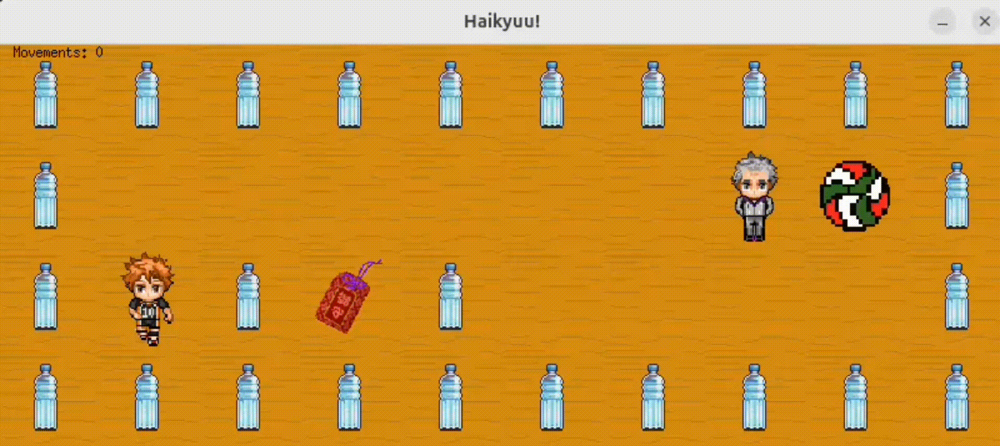
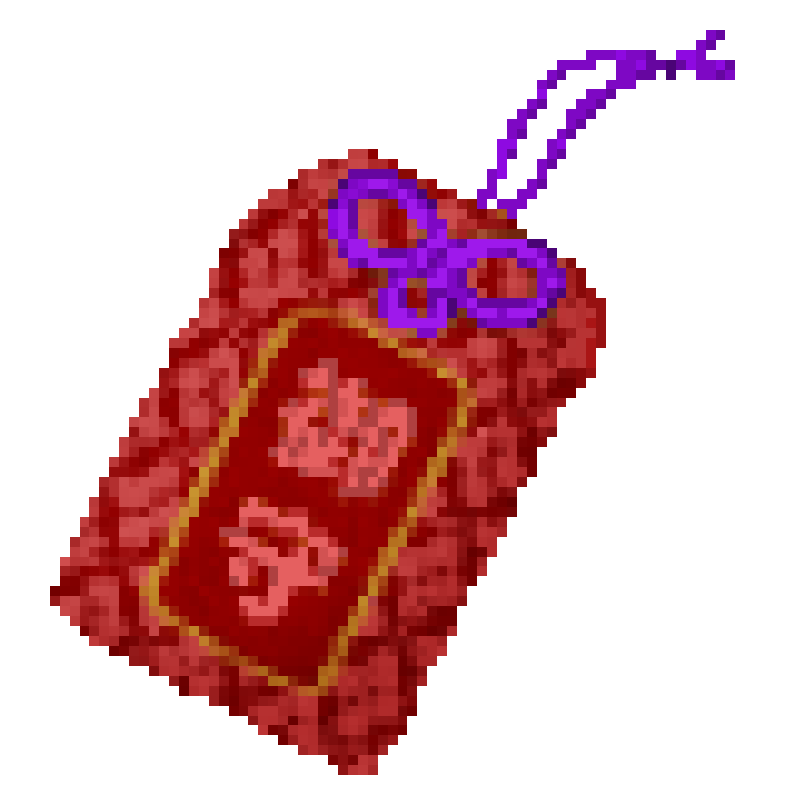

# 🏐 so_long - Haikyuu!! Themed 2D Game

A 2D top-down game made with Pixer Art created as part of the 42 school curriculum, based on the **MiniLibX** graphics library.  
This version is specially themed after the anime **Haikyuu!!**, featuring custom sprites and animations.



---

## 📚 Table of Contents

- [🎮 Game Concept](#-game-concept)
- [📦 Features](#-features)
- [🎁 Bonus Features](#-bonus-features)
- [🛠️ How to Build](#️-how-to-build)
- [📁 Map Format](#-map-format)
- [🚀 How to Play](#-how-to-play)
- [🧠 Dependencies](#-dependencies)
- [📸 Match Highlights](#-match-highlights)

---

## 🎮 Game Concept

In this game, you play as **Hinata Shoyo**, the energetic volleyball player, navigating through a gym full of volleyballs (collectibles) while avoiding enemies and obstacles. Your goal is to collect all the volleyballs and escape before being caught by the enemy!

### Characters & Assets

| Game Element | Replaced with |
|--------------|----------------|
| Player       | Hinata Shoyo (with directional movement animations) |
| Collectibles | Volleyballs 🏐 |
| Enemy        | Shiratorizawa’s coach |
| Walls        | Water bottles 🧴 |
| Floor        | Volleyball gym floor 🏐 |
| Exit         | Charm |


|  |  |  |
|----------------------------------|----------------------------------|----------------------------------|

---

## 📦 Features

- Smooth player movement using **W, A, S, D** keys
- Directional animations
- Patrol-based enemy that ends the game on contact
- Movement counter displayed on screen
- Escape using the **E** tile after collecting all items
- Clean exit on **ESC key** or window close button
- Full map validation and error handling
- Bonus: sprite animations and enemy patrol

---
## 🎁 Bonus Features
✔ Enemy patrol logic

✔ On-screen movement counter

✔ Sprite animations for the player

✔ Themed visuals and custom assets

---
## 🛠️ How to Build

```bash
make
```
```bash
make bonus  # to compile with bonus features
````
````bash
make clean     # removes object files  
make fclean    # removes object files and executable  
make re        # rebuild from scratch  
````
---

## 📁 Map Format

Your map must be a `.ber` file made of the following characters:

| Symbol | Meaning            |
|--------|--------------------|
| `1`    | Wall               |
| `0`    | Empty space        |
| `C`    | Collectible        |
| `E`    | Exit               |
| `P`    | Player start       |

Example:
````
111111
1P0C01
100001
1C0E01
111111
````

Map must be:
- Rectangular
- Surrounded by walls
- Include at least one `P`, one `C`, and one `E`
---

## 🚀 How to Play
There is a few map examples in the directory 'maps', feel free to test them!

````bash
./so_long maps/example.ber
````
Controls:
  - W, A, S, D → Move Hinata
  - ESC or red window X → Exit game

---

## 🧠 Dependencies

  - MiniLibX (graphics)
  - Libft (custom C utility library)
  - Ft_printf (my own function printf)
  - GNL (text line processor)
  - Uses system calls: open, close, read, write, printf, malloc, free, perror, strerror, exit
---
## 📸 Match Highlights


